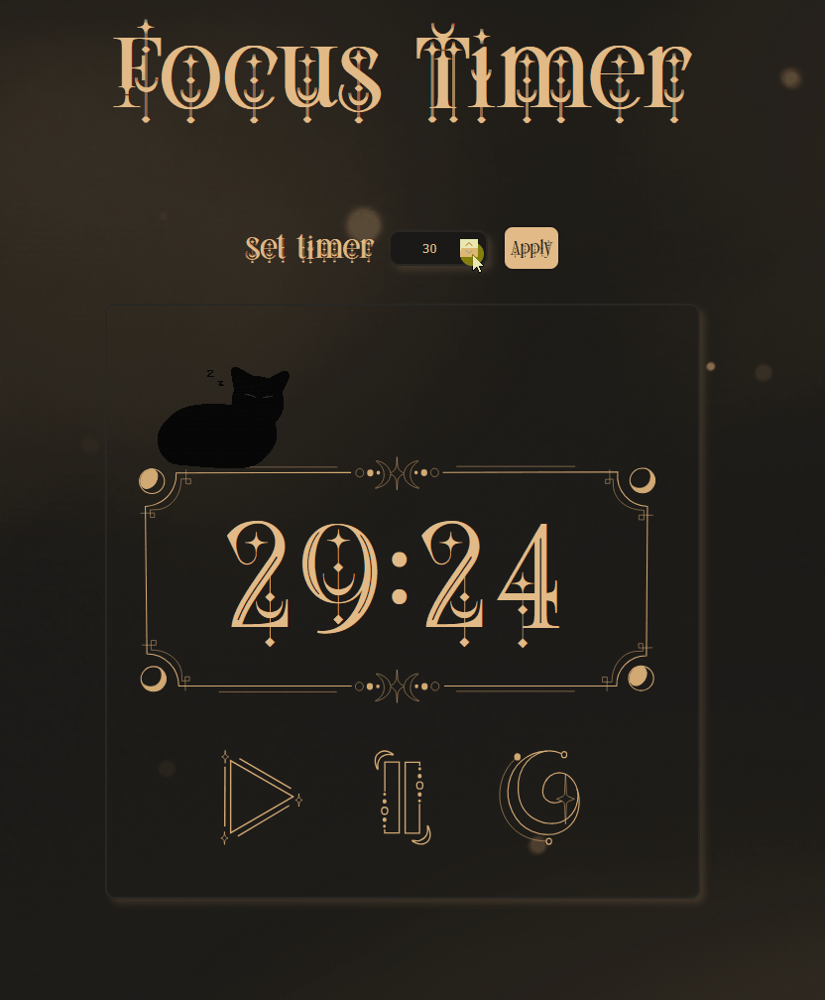

# ☾⋆.˚ Focus Timer ☾⋆.˚

A responsive React focus timer designed to help users manage focused work sessions with custom artwork.

## Demo


[Try the Live Focus Timer](https://focus-timer-react-yyb6.vercel.app/)

## Installation

Clone the repository and install the required dependencies:

```bash
git clone https://github.com/Batoul68/Focus-Timer-React.git
cd Focus-Timer-React
npm install
```

## Usage

Start the local development server:

```bash
npm run dev
```

Vite will display a local URL in the terminal, usually:

```text
http://localhost:5173
```

Open the URL in your browser to use the timer locally.

To create a production build:

```bash
npm run build
```

To preview the production build locally:

```bash
npm run preview
```

### Using the Timer

1. Enter the desired number of minutes in the custom time field.
2. Select **Apply** to update the timer.
3. Select the **start button** to begin the countdown.
4. Select the **pause button** to temporarily stop the countdown.
5. Select the **reset button** to return the timer to its starting time.

The cat illustration will change to its awake state when the timer is running and back to its asleep state when the timer is paused or reset.

## Features

- Start, pause, and reset timer controls
- Custom focus-session length
- Minutes and seconds displayed in a two-digit format
- Animated cat states based on whether the timer is running
- Responsive layout for different screen sizes
- Custom timer frame, background, illustrations, and assets
- Custom local fonts
- Component-based React structure
- Live deployment through Vercel

## Tech Stack

- React
- JavaScript
- CSS Modules
- HTML
- Vite
- Node.js and npm
- Vercel
- Git and GitHub

## Credits

The custom interface, timer frame, background, and cat illustrations were designed for this project.

Created as a portfolio project to practice:

- React components
- State management
- Props and event handling
- Timer interval logic
- Conditional rendering
- Responsive CSS
- Custom asset integration
- Deployment with Vercel

Created by **Batoul Al-Souaijet**

[GitHub](https://github.com/Batoul68)
[LinkedIn](www.linkedin.com/in/batoul-al-souaijet-45780125b)

